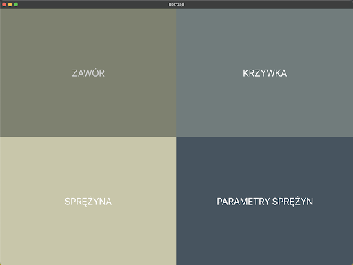
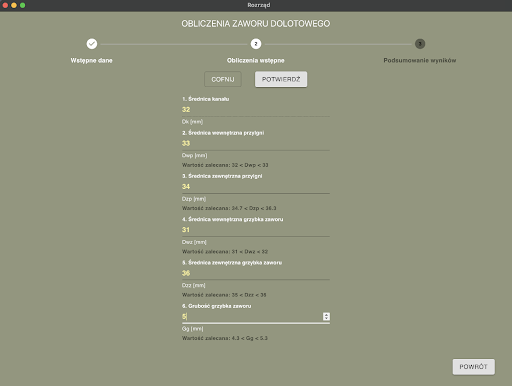

# Rozrzad-v3

Rozrzad-v3 is an Electron application developed as part of an engineering thesis at the Lodz University of Technology. The application is designed to manage and visualize timing belt schedules.

## Technologies Used

- **Electron**: For building cross-platform desktop applications with JavaScript, HTML, and CSS.
- **React**: A JavaScript library for building user interfaces.
- **React Router**: For handling routing in the application.
- **Styled Components**: For styling React components.
- **Material-UI**: For UI components.
- **Chart.js**: For creating charts and visualizations.
- **React Hook Form**: For managing form state.
- **Redux Toolkit**: For state management.
- **Yup**: For schema validation.
- **TypeScript**: For static type checking.
- **ESLint**: For linting and code quality.
- **Vite**: For fast development and build tooling.

## Application Overview

Rozrzad-v3 is designed to help users manage and visualize timing belt schedules efficiently. The application provides an intuitive user interface built with React and Material-UI, ensuring a seamless user experience. The state management is handled using Redux Toolkit, which simplifies the process of managing complex state logic.

### Home Page





More screenshots and documentation here: [Full Thesis MDX](./overview/Lucas%20Piera%20BE%20Thesis.md). Unfortunatelly it's written in Polish language.

### Documentation

For more detailed documentation, please refer to my [Engineering Thesis Documentation](https://docs.google.com/document/d/1nOEDN9K-TVxDbau-u89w0ydMin6w64-WQAKN-v6lBoc/edit?tab=t.0)

### Key Features

- **Timing Belt Schedule Management**: Easily create, edit, and delete timing belt schedules.
- **Visualization**: Utilize Chart.js to visualize timing belt schedules and other related data.
- **Form Handling**: Use React Hook Form and Yup for robust form validation and management.
- **Routing**: Navigate through different sections of the application using React Router.
- **Styling**: Styled Components are used to create modular and reusable styles for the application.

### Development Process

The development of Rozrzad-v3 followed best practices in modern web development. The project was bootstrapped with Vite for fast development and build tooling. TypeScript was used throughout the codebase to ensure type safety and improve code quality. ESLint was integrated to maintain a consistent code style and catch potential issues early in the development process.

## Getting Started

### Prerequisites

- Node.js
- npm or yarn

### Installation

1. Clone the repository:

   ```sh
   git clone https://github.com/yourusername/rozrzad-v3.git
   cd rozrzad-v3
   ```

2. Install dependencies:
   ```sh
   npm install
   # or
   yarn install
   ```

### Running the Application

To start the application in development mode, run:

```sh
npm start
# or
yarn start
```

### Building the Application

To package the application for distribution, run:

```sh
npm run package
# or
yarn package
```
